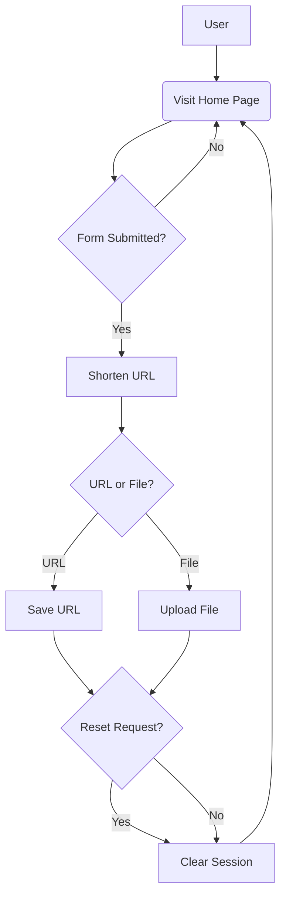

  
<!-- PROJECT SHIELDS -->  
[![Contributors][contributors-shield]][contributors-url]  
![Commits][commit-shield]  
![pypi-shield]  
  

  
<br />  
<div align="center">  
    <h1 align="center">CSC 256 Group 5 Project Readme</h1>  
</div>  
  
  
  
<!-- TABLE OF CONTENTS -->  
  
# Table of Contents:  
  
- [Introduction](#introduction)  
- [Selenium](#selenium)  
  - [Setup](#setup)  
  - [Basics](#basics)  
  - [UnitTest](#unittest)  
- [BDD](#bdd)  
  - [Gherkin](#gherkin)  
  - [Behave](#behave)  
- [Postman](#postman)  
  - [Installation](#installation)  
  - [Lab](#lab)  
- [Request Library](#request)   
- [Postman vs. Request Library](#postman-vs-request-library)  
  - [Similarities](#similarities)  
  - [Advantages](#advantages)  
  - [Disadvantages](#disadvantages)  
  - [Conclusion](#conclusion) 
- [TDD](#test-driven-development-tdd)  
  - [Red-Green-Refactor Cycle](#red-green-refactor-cycle)  
  - [Workflow](#tdd-workflow)   
  - [Best Practices](#tdd-best-practices) 
  - [Frameworks](#common-testing-frameworks)
- [Playwright](#introduction-to-playwright-with-python-for-web-testing)
  - [Objective](#objective)
  - [Getting Started](#getting-started)
  - [Explore](#explore-playwright-documentation-for-python)
  
  
<!-- ABOUT THE PROJECT -->  
# Introduction  
### Purpose   
> This document provides detailed instructions for testing a provided web application using Selenium, BDD testing with Behave, Postman and Python's Request Library, TDD, and Playwright. 
  
### Contributers   
- Dmytro Holovnia - Developer  
- Matthew Salstrom - Developer  
- Max Tart - Developer  
- Dylan Arone - Tester  
- Ian Kepplinger - Tester  
- Ever Morales Alverez - Tester  
- Denitri Douglas - Document Writer  
- Keven Hernandez Gaspar - Document Writer  
- Eric Dixon - Document Writer  
      
### Tools Used: - Python  
- Selenium  
- Flask
- Behave
- Postman
- Request
- Playwright
  
# Selenium  
Selenium empowers developers and quality assurance teams to automate the testing of web applications by using Python scripts to interact with web elements, simulate user interactions, and validate the functionality and user experience of web pages, ensuring that the application works as intended and functions consistently across various browsers and browser versions. It serves as a versatile tool for functional testing, regression testing, and cross-browser testing, enabling efficient and repeatable testing processes integrated into software development workflows.  
  
# Setup  
  
### Download Selenium Branch  
1. Open your preferred web browser and go to the GitHub repository: https://github.com/mssalstrom/Group5-repo-projects.  
2. On the repository page, click on the green "Code" button located near the top-right corner.  
3. From the dropdown menu, click on "Download ZIP" to download the main branch as a compressed ZIP file.  
4. Once the ZIP file is downloaded, locate it on your computer and extract its contents to a desired location. This will create a folder containing the main branch files.  
  
### Installing Required Dependencies  
1. Open your Python IDE (Integrated Development Environment) and navigate to the folder containing the extracted Selenium branch files.  
2. Open the file app.py  
3. In the terminal or command prompt, run the following command to install the required dependencies:  
    
>In python terminal  
```python  
# Install the required dependencies specified in the 'requirements.txt' file  
pip install -r requirements.txt  
  
```  
  
### Verify package installation:   
```python  
# Check the version of Flask installed  
flask --version  
```  
On Windows:  
```python  
# Display information about the Selenium package using Python's built-in package manager  
python -m pip show selenium  
```  
On Mac:  
```python  
# Display information about the Selenium package using Python's package manager (pip3)  
pip3 show selenium  
```  
- Expected outcome: *The command should display the version information of Flask, indicating that it has been installed correctly. There should be no errors or warnings.*  
- If you do encounter errors proceed with the individual installations below, if not skip to the "Basics" section.  
    
### Installing Flask:
```python  
# Install the Flask framework using pip  
pip install flask  
```  
```python  
# Check the version of Flask installed  
flask --version  
```  
  
### Installing Selenium:   
On Windows:   
```python  
# Install the Selenium package using Python's built-in package manager (pip)  
python -m pip install selenium  
```  
On Mac:  
```python  
# Install the Selenium package using Python package manager.  
pip3 install selenium  
```  
### Verify Selenium Installation:   
On Windows:  
```cmd  
python -m pip show selenium  
```  
On Mac:  
```cmd  
pip3 show selenium  
```  
- Expected outcome: *The command should display information about the Selenium package, including the version number, indicating that it has been installed correctly. There should be no errors or warnings.*  
  
### Launch the Flask Web Application  
1. In your Python IDE, open the app.py file.  
2. Run the app.py file using the appropriate command or IDE feature to start the Flask server.  
3. After running the app.py file, switch to the Python terminal or console within your IDE. This is where you will see the server startup message.  
4. In the Python terminal, you should see the message "*Running on http://127.0.0.1:5000".  
5. Open your web browser and enter the following URL in the address bar: http://127.0.0.1:5000.  
6. Press Enter to access the web application.  
7. If the web application "URL Shortener" opens successfully, you have set up the lab correctly. If not, review the above steps to ensure that Flask and Selenium are installed correctly.  
  
Below are a series of test in the selenium suite of tools that can be used to automate test for a python web application.   
  
- Create a new python file named "seleniumLab.py" in the test directory.   
  
### Basics  
**1. Using Selenium to test link navigation:**  
- Import libraries  
```python  
import os  
import time  
from selenium import webdriver  
from selenium.webdriver.common.keys import Keys  
from selenium.webdriver.common.by import By  
```  
  
  
- #### Create webdriver object  
```python  
#Create a WebDriver object for the Microsoft Edge browser  
driver = webdriver.Edge()  
```  
- #### Set window size  
```python  
#Set the window size of the web browser to 800 pixels in width and 800 pixels in height  
driver.set_window_size(800, 800)  
```  
```python  
# Define the URL of the local web application you want to interact with  
local_url = "localhost:5000"  
```  
  
- #### Launching link:   
```python  
d# Navigate the web browser to the specified local URL  
driver.get(local_url)  # Expected outcome: browser should navigate to the link  
  
```  
  
  
&#160;&#160;&#160;Expected outcome: *browser should navigate to link*  
  
**2. Using Selenium to find elements:**   
```python  
# Locate the HTML element with the "name" attribute set to "url" using Selenium's find_element method  
url_element = driver.find_element(By.NAME, "url")  
```  
```python  
# Locate the HTML element with the "name" attribute set to "code" using Selenium's find_element method  
code_element = driver.find_element(By.NAME, "code")  
```  
```python  
# Locate the HTML element with the "ID" attribute set to "shortenSubmit" using Selenium's find_element method  
submit_button = driver.find_element(By.ID, "shortenSubmit")  
```  
**3. Using Selenium to test website functionality:**   
- Clear preexisitng text and type python.org into url shortener  
```python  
# Clear any preexisting text or input in the "url_element" field  
url_element.clear()  
```  
```python  
# Enter the URL "https://python.org" into the "url_element" input field  
url_element.send_keys("https://python.org")  
```  
  
- Clear preexisitng text and type python as shortened url  
```python # Clear any preexisting text or input in the "code_element" field  
code_element.clear()  
```  
  
```python  
# Enter the text "python" into the "code_element" input field  
code_element.send_keys("python")  
```  
- Click submit  
  
```python  
# Simulate a click action on the "submit_button" element  
submit_button.click()  
```  
  
  
- Wait 10s to verify page  
```python  
# Pause the script's execution for 10 seconds to allow time for the page to load or for verification  
time.sleep(10)  
```  
- Go back to homepage  
  
- Testing file input   
```python  
# Navigate the web browser to the "local_url" to return to the homepage or a specific URL  
driver.get(local_url)  
```  
```python  
# Locate the HTML element with the "ID" attribute set to "fileInput" using Selenium's find_element method  
fileElement = driver.find_element(By.ID, "fileInput")  
```  
```python  
# Simulate selecting a file by sending the file path to the "fileElement" input field  
fileElement.send_keys(file_path)  
```  
```python  
# Locate the HTML element with the "ID" attribute set to "codeName" using Selenium's find_element method  
codeNameElement = driver.find_element(By.ID, "codeName")  
```  
```python  
# Enter the text "Shortname" into the "codeNameElement" input field  
codeNameElement.send_keys("Shortname")  
```  
```python  
# Pause the script's execution for 10 seconds to allow time for the page to load or for verification  
time.sleep(10)  
```  
  
  
- Retesting with longer URL  
- Clear pre-exisitng text and type python.org into url shortener  
```python  
# Clear the input field for the URL element  
url_element.clear()  
```  
```python  
#Enter a long URL into the URL shortener form  
url_element.send_keys("[https://python.org](https://www.cnn.com/2023/02/09/us/iyw-puppy-bowl-shelters-rescue-groups/index.html)")  
```  
  
- Clear preexisitng text and type python as shortened url  
```python  
# Clear the input field for the URL element code_element.clear()  
```  
  
```python  
# Entering the text "puppyBowl" into the code_element  
code_element.send_keys("puppyBowl")  
```  
- Click submit  
  
```python  
# Simulate a click action on the "submit_button" element  
submit_button.click()  
```  
  
  
- Wait 10s to verify page  
```python  
# Introduce a 10-second delay in the script's execution  
time.sleep(10)  
```  
- Go back to homepage  
    
```python  
# Navigate the web driver to the local URL specified by 'local_url'  
driver.get(local_url)  
```  
- Testing file input  
```python  
# Locate the file input element on the web page with the ID attribute "fileInput"  
fileElement = driver.find_element(By.ID, "fileInput")  
  
```  
```python  
# Simulate user interaction by providing a file path to the 'fileElement' input  
fileElement.send_keys(file_path)  
```  
```python  
# Locate the web element with the ID "codeName" on the page  
codeNameElement = driver.find_element(By.ID, "codeName")  
```  
```python  
# Enter the text "Shortname" into the 'codeNameElement' input  
codeNameElement.send_keys("Shortname")  
```  
```python  
# Pause the script's execution for 10 seconds to allow time for the page to load or for verification  
time.sleep(10)  
```  
  
### UnitTest  
Selenin's strength is the ability to automate test. Below is an exmaple of a UnitTest using the selenium library  
- Create a file named UnitTest.py in the test directory  
 - Import necessary libraries  
```cmd  
import unittest  
from selenium import webdriver  
from selenium.webdriver.common.keys import Keys  
from selenium.webdriver.common.by import By  
```  
- Create a class that inherits the TestCase class  
  
```python  
# Define a test case class for URL shortening functionality  
class urlShortener(unittest.TestCase):  
```  
- Initialize the webdriver  
```python  
 def setUp(self): # Initialize a Microsoft Edge web driver for testing self.driver = webdriver.Edge()  
```  
- Declare the test case method  
```python  
 # This method tests the URL shortening functionality # and contains the test cases for the URL shortener. def test_urlShortener(self):  
```  
- Set the driver  
```python  
 # Assign the web driver instance to the 'driver' variable driver = self.driver  
```  
- Navigate to web application  
```python  
 # Define the URL of the local web application you want to interact with driver.get("localhost:5000")  
```  
- Assertion to confirm site title  
```python  
 # Check if "urlShortener" is present in the title of the current web page self.assertIn("urlShortener", driver.title)  
```  
- locate elements in page  
```python  
 # Locate the element with the name attribute set to "url" url_element = driver.find_element(By.NAME, "url")  
 # Locate the element with the name attribute set to "code" code_element = driver.find_element(By.NAME, "code")  
 # Locate the element with the ID attribute set to "shortenSubmit" submit_button = driver.find_element(By.ID, "shortenSubmit")
```  
- Send data  
```python  
 # Clear any existing text in the 'url_element' input field url_element.clear() # Enter the URL "https://python.org" into the 'url_element' input field url_element.send_keys("https://python.org") # Click the 'submit_button' to initiate the URL shortening process submit_button.click()
```  
- Wait to verify page  
```python  
 # Pause the script execution for 10 seconds time.sleep(10)    
```  
- Close driver  
```python  
 # Define the 'tearDown' method for cleaning up after the test casedef tearDown(self):  
 # Close the web driver instance to release system resources self.driver.close()  
```  
- Execute test  
```python  
# Check if the current script is the main module being executed  
if __name__ == "__main__":  
 # If the script is the main module, execute the following code unittest.main() # Run the test cases using the unittest test runner  
```  
# BDD  
  
## Behavior-Driven Development (BDD)  
  
**Behavior-Driven Development (BDD)** is a software development methodology that focuses on collaboration between technical and non-technical team members to improve the understanding of the desired behavior of a software system. BDD emphasizes using natural language descriptions to express the expected behavior of the system, making it accessible to non-technical stakeholders. It helps in aligning development efforts with business objectives and promotes a shared understanding of the software's features.  
  
Key aspects of BDD include:  
  
1. **Natural Language Specifications**: BDD encourages writing specifications in plain, human-readable language, often using a structured format like Gherkin. This language can be understood by both technical and non-technical team members.  
  
2. **Collaboration**: BDD promotes collaboration between developers, testers, business analysts, and other stakeholders to define, validate, and document requirements.  
  
3. **Examples and Scenarios**: BDD uses concrete examples and scenarios to illustrate the desired behavior of the system, making it easier to understand and test.  
  
4. **Test-Driven Development (TDD)**: BDD often integrates with TDD, with the behavioral specifications serving as high-level tests that guide the development process.  
  
5. **Automated Testing**: BDD encourages the automation of tests based on the specified behavior. These tests help ensure that the software functions as expected throughout the development process.  
  
# Gherkin  
  
Gherkin is a plain-text language that is used to describe the behavior of a software system. It is widely used in the context of Behavior-Driven Development (BDD) and is commonly associated with tools like Cucumber and Behave for Python. Gherkin syntax is designed to be human-readable and easy to understand by non-technical stakeholders. Here's an explanation of Gherkin syntax using Python as an example:  
  
Gherkin syntax follows a structured format that includes features, scenarios, and steps. Here's how it works:  
  
1. **Feature**: A Gherkin feature is a high-level description of a software feature or functionality. It is typically written at the beginning of a Gherkin file and serves as an introduction to what the following scenarios are about. In Python, it might look like this:  
  
```gherkin  
Feature: Login Functionality
Scenario: User can log in with valid credentials Given the user is on the login page When the user enters valid credentials And clicks the "Login" button Then the user should be logged in  
```  
2. **Scenario**: A scenario describes a specific example of how the software behaves in a given situation. Scenarios are written beneath the feature and are often used to illustrate different use cases. In Python:  
  
```gherkin  
Scenario: User can log in with valid credentials  
Given the user is on the login page When the user enters valid credentials And clicks the "Login" button Then the user should be logged in  
```  
3. **Steps**: Steps are the building blocks of Gherkin scenarios. Each step begins with one of the keywords "Given," "When," or "Then." These keywords specify the context, action, or expected outcome of the step. In Python, you define step definitions in code to match Gherkin steps and map them to actual actions in the software. Here's an example of steps:  
  
```gherkin  
Given the user is on the login page  
When the user enters valid credentials And clicks the "Login" button Then the user should be logged in  
```  
  In Python code, you would create step definitions to implement these steps, such as opening a web page, entering data, clicking buttons, and verifying results.  
  
4. **And/But**: "And" and "But" are used to continue the previous step's context, action, or expected outcome. They are used to keep the scenario description concise and more readable.  
  
In Python, you typically use a BDD framework like Behave to map Gherkin steps to Python code. Step definitions in Python code provide the actual implementation of the steps, allowing you to automate the testing of the described scenarios. This approach promotes collaboration and ensures that the software behaves as expected based on the Gherkin specifications.  
  
  
# Behave  
  
**Behave** is a Python library that facilitates BDD by allowing you to write and execute behavioral tests using Gherkin language specifications. Behave acts as the bridge between plain language specifications (Gherkin) and Python code. It provides the framework to define Gherkin scenarios and the associated Python code that implements the steps of those scenarios.  
  
#### **In the lab below we will use gherkin to implement selenium test on the web application provided in this repo.**  
  
1. **Install Behave**:  
   If you haven't already, install Behave using pip:  
  
```bash  
pip install behave
 ```
 
2. **Create Feature Files**:  
   Feature files are written in Gherkin language and describe the behavior of your application. You can create feature files for different parts of your application. For example, create a `your_app.feature` file in the dedicated folder for your Behave tests.  
  
```gherkin  
Feature: Testing Your Flask Application
Scenario: Accessing the homepage Given the Flask application is running When I access the homepage Then I should see "Welcome to My Flask App" on the page  
Scenario: Shortening a URL Given I am on the homepage When I enter a long URL and a short code And I submit the form Then I should see a success message  
```  
3. **Implement Step Definitions**:  
Step definitions are Python functions that map the Gherkin steps to actions in your application. Create a Python file (e.g., `your_app_steps.py`) in the same folder as your feature files and define step definitions.  

```python  
from behave import *  

@given("the Flask application is running") def step_flask_app_running(context): # Implement code to start your Flask application or set up the testing environment context.driver = webdriver.Edge() context.driver.set_window_size(800, 800)  
@when("I access the homepage") def step_access_homepage(context): # Implement code to navigate to the homepage using Selenium context.driver.get("http://localhost:5000")  
@then('I should see "{text}" on the page') def step_check_page_text(context, text): # Implement code to check if the specified text is present on the page page_source = context.driver.page_source assert text in page_source  
@when("I enter a long URL and a short code") def step_enter_long_url_and_short_code(context): # Implement code to interact with the URL shortening form url_element = context.driver.find_element(By.NAME, "url") url_element.clear() url_element.send_keys("https://python.org")  
@when("I submit the form") def step_submit_form(context): # Implement code to submit the form using Selenium submit_button = context.driver.find_element(By.ID, "shortenSubmit") submit_button.click()  
@then("I should see a success message") def step_check_success_message(context): # Implement code to check if a success message is displayed on the page success_message_element = context.driver.find_element(By.ID, "successMessage") assert success_message_element.is_displayed()  
```   
4. **Run Behave Tests**:  

   Open your command prompt or terminal, navigate to the directory where your feature files and step definitions are located, and run the following command:  
  
```bash  
  behave  
 ```  
  Behave will execute the Gherkin scenarios and map them to the corresponding step definitions, reporting the results of each scenario.  
  
By following these steps, you can incorporate BDD with Behave and Gherkin into your Selenium tests for the Flask application. This approach enhances collaboration, clarifies requirements, and ensures your application behaves as expected based on the defined scenarios.  
  
# Postman  
## Overview  
  
[Postman](https://www.postman.com/) is a collaboration platform for API development that simplifies the process of designing, testing, and documenting APIs. It provides a user-friendly interface for creating and sending HTTP requests, testing API endpoints, and managing collections of requests.  
  
#### Postman Collection Link  
  
[Postman Collection](https://www.postman.com/collections/your-collection-id)  
  
Replace "your-collection-id" with the actual collection ID generated in Postman.  
  
#### Postman Lab Instructions  
  
# Installation   
  
1. **Download and Install Postman:**  
  
  If you don't have Postman installed, follow these steps to download and install it:  
  
   - Visit the [official Postman download page](https://www.postman.com/downloads/).  
   - Choose the appropriate version based on your operating system (Windows, macOS, or Linux).  
   - Download the installer and run it to install Postman on your machine.  
  
# Lab   
  
2. **Accessing the Home Page:**  
  
 - Open Postman and import the provided collection.  
     - Click on "Import" in the top-left corner.  
     - Select the "Link" tab.  
     - Paste the collection link: [Postman Collection](https://www.postman.com/collections/your-collection-id).  
     - Click "Continue" and then "Import."  
   - Select the "Access Home Page" request.  
   - Click the "Send" button to make a GET request to the home page.  
   - Verify that the response includes the expected text: "Welcome to My Flask App."  
  
```http  
GET http://localhost:5000/  
```  
  
3. **Shortening a URL:**  
  
 - Select the "Shorten URL" request.  
   - Set the request method to POST.  
   - Set the request URL to the appropriate endpoint for shortening a URL.  
   - In the request body, provide the necessary data:  
     - Set the `code` parameter for the short code (e.g., "postmanTest").  
     - Set the `url` parameter for the URL to be shortened (e.g., "https://www.postman.com").  
   - Click the "Send" button to make the request.  
   - Verify that the response includes the expected success message.  
  
```http  
POST http://localhost:5000/your_url  
Content-Type: application/x-www-form-urlencoded  
code=postmanTest&url=https://www.postman.com  
```  
  
4. **Redirecting to Shortened URL:**  
  
 - Select the "Redirect to Shortened URL" request.  
   - Set the request method to GET.  
   - Set the request URL to the appropriate endpoint for redirecting to a shortened URL (e.g., "/postmanTest").  
   - Click the "Send" button to make the request.  
   - Verify that the response redirects to the expected URL.  
  
```http  
GET http://localhost:5000/postmanTest  
```  
  
5. **Error Handling - Nonexistent Short Code:**  
  
 - Select the "Error Handling - Nonexistent Short Code" request.  
   - Set the request method to GET.  
   - Set the request URL to an endpoint with a nonexistent short code (e.g., "/nonexistentCode").  
   - Click the "Send" button to make the request.  
   - Verify that the response includes a 404 status code.  
  
```http  
GET http://localhost:5000/nonexistentCode  
```  
  
6. **Error Handling - Existing Short Code as URL:**  
  
 - Select the "Error Handling - Existing Short Code as URL" request.  
   - Set the request method to GET.  
   - Set the request URL to an endpoint with an existing short code that represents a URL (e.g., "/python").  
   - Click the "Send" button to make the request.  
   - Verify that the response redirects to the expected URL.  
  
```http  
GET http://localhost:5000/python  
```  
  
7. **Error Handling - Existing Short Code as File:**  
  
 - Select the "Error Handling - Existing Short Code as File" request.  
   - Set the request method to GET.  
   - Set the request URL to an endpoint with an existing short code that represents a file (e.g., "/Shortname").  
   - Click the "Send" button to make the request.  
   - Verify that the response redirects to the expected file.  
  
```http  
GET http://localhost:5000/Shortname  
```  
  
8. **Clearing the URL List:**  
  
 - Select the "Clear URL List" request.  
   - Set the request method to POST.  
   - Click the "Send" button to make the request.  
   - Verify that the response indicates successful clearing of the URL list.  
  
```http  
POST http://localhost:5000/  
```  
  
9. **API Endpoint - Get Session Keys:**  
  
 - Select the "API - Get Session Keys" request.  
   - Set the request method to GET.  
   - Click the "Send"  
  
button to make the request.  
 - Verify that the response includes the expected session keys.  
  
```http  
GET http://localhost:5000/api/session-keys  
```  
  
10. **API Endpoint - Add Session Key:**  
  
 - Select the "API - Add Session Key" request.  
 - Set the request method to POST.  
 - Set the request URL to the appropriate endpoint for adding a session key.  
 - In the request body, provide the necessary data:  
     - Set the `key` parameter for the session key (e.g., "newSessionKey").  
 - Click the "Send" button to make the request.  
 - Verify that the response includes the expected success message.  
  
```http  
POST http://localhost:5000/api/add-session-key  
Content-Type: application/x-www-form-urlencoded  
key=newSessionKey  
```  
  
11. **API Endpoint - Delete Session Key:**  
  
 - Select the "API - Delete Session Key" request.  
 - Set the request method to DELETE.  
 - Set the request URL to the appropriate endpoint for deleting a session key (e.g., "/api/delete-session-key/newSessionKey").  
 - Click the "Send" button to make the request.  
 - Verify that the response includes the expected success message.  
  
```http  
DELETE http://localhost:5000/api/delete-session-key/newSessionKey  
```  
  
12. **API Endpoint - Error Handling - Nonexistent Session Key:**  
  
 - Select the "API - Error Handling - Nonexistent Session Key" request.  
 - Set the request method to GET.  
 - Set the request URL to an endpoint with a nonexistent session key (e.g., "/api/get-session-key/nonexistentKey").  
 - Click the "Send" button to make the request.  
 - Verify that the response includes a 404 status code.  
  
```http  
GET http://localhost:5000/api/get-session-key/nonexistentKey  
```  
# Request  
### Python `requests` Library:  
  
The `requests` library is a popular HTTP library for making HTTP requests in Python. It simplifies the process of sending HTTP requests and handling responses. Some key features include:  
  
- **Simplicity:** The library provides a simple and straightforward API for sending HTTP requests. It abstracts the complexities of handling various HTTP methods, headers, and parameters.  
  
- **Versatility:** It supports various HTTP methods such as GET, POST, PUT, DELETE, etc. It also allows customization of request headers, parameters, and authentication.  
  
- **Session Handling:** The library supports session handling, allowing you to persist certain parameters, such as cookies, across multiple requests within the same session.  
  
- **JSON Parsing:** It automatically parses JSON responses, making it easy to work with APIs that return JSON data.  
  
### Python `requests` Library Lab for Testing APIs  
  
1. **Install Required Package:**  
  
  Ensure you have the `requests` library installed. If not, install it using:  
  
   ```bash  
  pip install requests 
  ```  
2. **Create a Test Script:**  
  
  Create a new Python script (e.g., `api_test.py`) in the same directory as your Flask application.  
  
   ```python  
  import requests  
  
 # Set the base URL for your Flask application base_url = 'http://localhost:5000'  
 def test_home_endpoint(): response = requests.get(f'{base_url}/') assert response.status_code == 200 assert response.text == 'Welcome to My Flask App'  
 def test_shorten_url_endpoint(): data = {'code': 'test', 'url': 'https://www.example.com'} response = requests.post(f'{base_url}/', data=data) assert response.status_code == 200 assert response.text == 'URL shortened successfully'  
 def test_redirect_to_url_endpoint(): response = requests.get(f'{base_url}/test') assert response.status_code == 302  # Expecting a redirect status code  
 def test_api_session_keys_endpoint(): response = requests.get(f'{base_url}/api/session-keys') assert response.status_code == 200 session_keys = response.json()['session_keys'] assert isinstance(session_keys, list)  
 def test_api_add_session_key_endpoint(): data = {'key': 'new_key'} response = requests.post(f'{base_url}/api/add-session-key', data=data) assert response.status_code == 200 assert response.text == 'Session key added successfully'  
 def test_api_delete_session_key_endpoint(): key_to_delete = 'new_key' response = requests.delete(f'{base_url}/api/delete-session-key/{key_to_delete}') assert response.status_code == 200 assert response.text == 'Session key deleted successfully'  
 if __name__ == '__main__': # Run your test functions test_home_endpoint() test_shorten_url_endpoint() test_redirect_to_url_endpoint() test_api_session_keys_endpoint() test_api_add_session_key_endpoint() test_api_delete_session_key_endpoint()  
 ```  
3. **Run the Test Script:**  
  
  Open your terminal, navigate to the directory containing your Flask application and the new Python script, and run:  
  
   ```bash  
  python api_test.py
   ```  
  Ensure that your Flask application is running (`python run.py`) while running the tests.  
  
# Postman vs. Request Library   
  
## Similarities:  
  
 **HTTP Requests:**  
 - Both Postman and the `requests` library are tools for sending HTTP requests to web servers.  
  
 **HTTP Methods:**  
 - Both support common HTTP methods like GET, POST, PUT, DELETE, etc.  
  
 **Headers and Parameters:**  
 - Both allow customization of HTTP headers and parameters for requests.  
  
**Response Handling:**  
 - Both provide features for handling and inspecting HTTP responses.  
  
## Advantages:  
### Postman  
  
 **Graphical Interface:**  
 - Postman provides a graphical user interface (GUI), making it user-friendly and accessible for users who may not be comfortable with writing code.  
  
 **API Documentation:**  
 - Postman can generate API documentation based on requests, making it easy to share and understand the usage of an API.  
  
 **Collections:**  
 - Postman allows organizing requests into collections, facilitating the management and execution of multiple requests.  
  
**Environment Variables:**  
 - Postman supports the use of environment variables, enabling the configuration of requests for different environments (e.g., development, testing, production).  
  
### `requests` Library:  
  
 **Scripting and Automation:**  
 - The `requests` library is well-suited for scripting and automation within Python scripts. It can be integrated into larger test suites or automation workflows.  
  
 **Integration with Testing Frameworks:**  
 - It integrates well with testing frameworks like `unittest` or `pytest`, allowing for the creation of comprehensive test suites.  
  
 **Version Control:**  
 - Code written using the `requests` library can be version-controlled along with the application code, providing better traceability and version history.  
  
## Disadvantages:  
  
 **Learning Curve:**  
 - The `requests` library may have a steeper learning curve for non-developers compared to the graphical interface of Postman.  
  
 **GUI vs. Code:**  
 - Postman's GUI may be preferred by users who are more comfortable with visual tools, while developers may find the `requests` library more natural.  
  
**Environment Setup:**  
 - The `requests` library requires Python and may involve some initial setup, whereas Postman is a standalone application.  
  
## Conclusion:  
  
- **Use Postman When:**  
 - Quick manual testing or exploration of APIs is required.  
  - Collaboration and sharing of API requests are essential.  
  - A graphical interface is preferred over code.  
  
- **Use `requests` Library When:**  
 - Automation and scripting within Python are required.  
  - Integration with testing frameworks or other Python-based tools is needed.  
  - Requests need to be version-controlled along with the application code.  
  
In summary, the choice between Postman and the `requests` library depends on the specific needs of the user, the context of the task, and the preference for a graphical interface or code-based approach. Both tools serve their purposes effectively in different scenarios.


# Test-Driven Development (TDD)

Test-Driven Development (TDD) is a software development approach where tests are written before the actual code. It is an iterative approach combining programming, unit test creation, and refactoring. 

### Extreme Programming and the Agile Manifesto are the roots of the TDD methodology.
   - Software development is driven by the test process, as the name implies.
   - It's also a structural technique that gives developers and testers optimal, long-lasting code.
   - Using TDD, developers build brief test cases for each feature based on their preliminary knowledge.

This technique's main goal is to write new or modified code solely in the event that the tests are unsuccessful. Test script duplication is avoided as a result.
The TDD process typically follows a cycle known as the Red-Green-Refactor cycle. 

## TDD Workflow:

- **Write a Test:**
  - Define a test case for a specific piece of functionality.
  - This test initially fails because there is no corresponding code.

- **Write the Code:**
  - Implement the minimum amount of code needed to make the test pass.
  - The goal is to write only what is necessary to fulfill the requirements of the test.

- **Run the Tests:**
  - Execute all tests to ensure the new code didn't break existing functionality.
  - If any test fails, revisit the code to address the issue.

- **Refactor Code (Optional):**
  - Refactor the code to improve its structure, readability, or performance.
  - Run the tests again to ensure that refactoring did not introduce new issues.

## Red-Green-Refactor Cycle:

### Red: Write a Failing Test

- Start by opening your project directory and creating a ```test_tdd.py``` file. 
- Add the following code to your ```test_tdd.py``` file:
```python
# Importing the 'is_even' function from the 'even_checker' module
from even_checker import is_even

# Importing the 'unittest' module for creating test cases
import unittest

# Creating a test class that inherits from 'unittest.TestCase'
class TestEvenChecker(unittest.TestCase):
    
    # Defining a test method for the 'is_even' function
    def test_is_even(self):
        # Asserting that is_even(4) returns True (since 4 is an even number)
        self.assertTrue(is_even(4))
        
        # Asserting that is_even(7) returns False (since 7 is an odd number)
        self.assertFalse(is_even(7))

# Checking if the script is being run as the main module
if __name__ == '__main__':
    # Running the tests defined in the 'TestEvenChecker' class
    unittest.main()

```
- Since there is no code for the ```is_even``` function, the test will fail. This is the ```Red``` part of the cycle.
### Green: Write the Minimum Code to Pass the Test

- Next, write the minimum amount of code necessary to make the test pass.
- Create a new file in your project directory name ```even_checker.py``` and add the following code:
```python
# Function to check if a given number is even
def is_even(number):
    # Return True if the number is evenly divisible by 2 (i.e., it's an even number)
    return number % 2 == 0
```
- Run the ```test_tdd.py``` file and ensure the test has passed.
- The goal is to make the test succeed, not to implement the entire feature.
- This is the ```Green``` part of the cycle, indicating success.


### Refactor: Improve Code Without Changing Its Behavior

- Once the test passes, refactor the code without changing its behavior. This is the ```Refector``` phase of TDD.
- Modify the ``is_even`` function in the ```even_checker.py``` file:
```python
# Function to check if a given number is even
def is_even(number):
    # Check if the input is a number (integer or float)
    if not isinstance(number, (int, float)):
        raise ValueError("Input must be a number")
    
    # Return True if the number is even, False otherwise
    return number % 2 == 0
```
- This step ensures that the code remains clean, maintainable, and efficient.
- The tests act as a safety net, catching any regressions introduced during refactoring.

## Red-Green-Refactor Cycle - Example 2


### Red: Write a Failing Test 

- Start by opening your project directory and adding the following code to your  ```test_tdd.py``` file:
```python
# Importing the necessary module or function from 'my_calculator'
from my_calculator import add_numbers

# Importing the 'unittest' module for creating test cases
import unittest

# Creating a test class that inherits from 'unittest.TestCase'
class TestCalculator(unittest.TestCase):
    
    # Defining a test method for the 'add_numbers' function
    def test_add_numbers(self):
        # Calling the 'add_numbers' function with arguments 2 and 3
        result = add_numbers(2, 3)
        
        # Asserting that the result is equal to the expected value (5)
        self.assertEqual(result, 5)

# This script can be executed to run the test defined in the 'TestCalculator' class
# Example usage:
# if __name__ == '__main__':
#     unittest.main()

```
- Since there is no code for the ```add_numbers function```, the test will fail.
### Green: Write the Minimum Code to Pass the Test

- Next, write the minimum amount of code necessary to make the new test pass.
- Create a new file in your project directory name ```my_calculator.py``` and add the following code:
```python
def add_numbers(a, b):
    return a + b
```

- Run the ```test_tdd.py``` file and ensure the test has passed.
- The goal is to make the test succeed, not to implement the entire feature.
- This is the ```Green``` part of the cycle, indicating success.


### Refactor: Improve Code Without Changing Its Behavior

- Once the test passes, refactor the code without changing its behavior. This is the ```Refactor``` phase of TDD.
- Refactor the ``add_numbers`` function in the ```my_calculator.py``` file:

```python
def add_numbers(a: int, b: int) -> int:
    return a + b
```

Run the ```test_tdd.py``` file again, ensuring all tests pass.

## Advantages of TDD:

- **Early Detection of Bugs:** By writing tests first, developers catch bugs early in the development process.
- **Improved Code Quality:** TDD often leads to cleaner, modular, and more maintainable code.
- **Regression Testing:** Tests act as a safety net, allowing developers to catch regressions when making changes.
- **Design Improvement:** TDD encourages modular and loosely coupled design, promoting good software architecture.

## TDD Best Practices:

- **Isolate Tests:** Tests should be independent of each other to ensure that the failure of one test does not affect others.
- **Keep Tests Fast:** Tests should run quickly to encourage frequent execution.
- **Test Only One Thing at a Time:** Each test should focus on a specific piece of functionality.
- **Write the Simplest Code That Works:** Avoid over-engineering and write the simplest code that fulfills the test requirements.

## Common Testing Frameworks:

- **JUnit (Java), NUnit (C#), pytest (Python):** Popular unit testing frameworks for various programming languages.
- **Jest (JavaScript), RSpec (Ruby):** Frameworks that support behavior-driven development (BDD) in addition to TDD.

In summary, TDD is a disciplined approach to software development that prioritizes writing tests before code. This practice leads to more reliable, maintainable, and bug-free software through iterative cycles of testing, implementation, and refactoring.
# Playwright

## Introduction to Playwright with Python for Web Testing

Developed by Microsoft, Playwright is an open-source library for automating browsers.
It provides a high-level API for automating actions in web browsers such as Chrome, Firefox, and WebKit. 
Playwright is designed to be fast, reliable, and capable of automating complex scenarios, making it suitable 
for end-to-end testing, browser automation, and web scraping.
## Objective

The objective of this lab is to introduce new developers to Playwright with Python, a powerful automation framework for end-to-end testing of web applications.

## Prerequisites

-   Basic understanding of web development concepts like HTML and CSS.
-   Familiarity with Python programming language.
-   Python and pip installed on the development machine.

## Getting Started

**Step 1: Install Playwright for Python**

1.  Open a terminal and navigate to your project directory.
    
2.  Install Playwright for Python using pip:

```bash
pip install playwright
```


**Step 2: Create a Basic Playwright Test in Python**

1.  Create a new Python script file named `test_examples.py` and open it in your preferred code editor.
    
2.  Write a simple Playwright test to open a browser, navigate to a webpage, and capture a screenshot:
  ```python   
  #test_examples.py
from playwright.sync_api import sync_playwright

# Importing the necessary Playwright functions for synchronous operation
from playwright.sync_api import sync_playwright

# Function to capture a screenshot of a web page
def test_screenshot():
    # Using 'sync_playwright' to create a synchronous Playwright context
    with sync_playwright() as p:
        # Launching a Chromium browser (Replace 'chromium' with your preferred browser)
        # Options: 'firefox', 'webkit' (for Firefox and WebKit respectively)
        browser = p.chromium.launch()

        # Creating a new page in the browser
        page = browser.new_page()

        # Navigating to the specified URL
        page.goto('https://www.saucedemo.com/')

        # Taking a screenshot and saving it to the specified path
        page.screenshot(path='test_screenshot.png')

        # Closing the browser
        browser.close()

# To use a different browser, replace 'chromium' with one of the following options:
# - 'firefox' for Mozilla Firefox
# - 'webkit' for WebKit (default on macOS)

# Example usage with Firefox:
# test_screenshot(browser_type='firefox')


**Step 3: Run the Playwright Test**

1.  Open a terminal and navigate to your project directory.
2.  Run the following command:
    
```bash
pytest
```

This will launch a headless browser, navigate to https://www.saucedemo.com/, capture a screenshot (saved as `test_screenshot.png`), and then close the browser.

## Web Interaction and Assertions

**Step 1: Modify the ```test_examples.py``` to include the Playwright ```expect``` package and add following test:**
    
```python
# Importing the necessary Playwright functions for synchronous operation
from playwright.sync_api import sync_playwright, expect

# Function to test web interactions on a login page
def test_web_interaction():
    # Using 'sync_playwright' to create a synchronous Playwright context
    with sync_playwright() as p:
        # Launching a Chromium browser (Replace 'chromium' with your preferred browser)
        # Options: 'firefox', 'webkit' (for Firefox and WebKit respectively)
        browser = p.chromium.launch()

        # Creating a new page in the browser
        page = browser.new_page()

        # Navigating to the specified URL
        page.goto('https://www.saucedemo.com/')

        # Filling in the username field with 'standard_user'
        page.fill('input[id="user-name"]', 'standard_user')

        # Filling in the password field with 'secret_sauce'
        page.fill('input[id="password"]', 'secret_sauce')

        # Clicking the login button
        page.click('input[name="login-button"]')

        # Expecting the text 'Swag Labs' to be visible on the page
        expect(page.locator('Swag Labs')).to_be_visible()

        # Closing the browser
        browser.close()

# To use a different browser, replace 'chromium' with one of the following options:
# - 'firefox' for Mozilla Firefox
# - 'webkit' for WebKit (default on macOS)

# Example usage with Firefox:
# test_web_interaction(browser_type='firefox')

```


**Step 2: Run the Web Interactive Test**

1.  Open a terminal and navigate to your project directory.
2.  Run the following command:

```bash
pytest
```

Observe the interactions with the browser. Ensure the test opens the page, logins in using the provided credentials
, selects the login button and the ***Swag Labs*** header is displayed.

## Response Assertions

Playwright assertions verify certain conditions or expectations during the execution of automated browser tests.
Assertions help ensure that the web application behaves as expected and that the desired elements and states are present
on the page.

**Step 1: Modify the ```test_examples.py``` to include the following test:**

```python
# Importing the necessary Playwright functions for synchronous operation
from playwright.sync_api import sync_playwright, expect

# Function to test the response of a web page
def test_response():
    # Using 'sync_playwright' to create a synchronous Playwright context
    with sync_playwright() as p:
        # Launching a Chromium browser (Replace 'chromium' with your preferred browser)
        # Options: 'firefox', 'webkit' (for Firefox and WebKit respectively)
        browser = p.chromium.launch()

        # Creating a new page in the browser
        page = browser.new_page()

        # Making a GET request to the specified URL and capturing the response
        response = page.request.get('https://www.saucedemo.com/')

        # Expecting the response to be successful (HTTP status code 200)
        expect(response).to_be_ok()

```
**Step 2: Run the Response Test**

1.  Open a terminal and navigate to your project directory.
2.  Run the following command:

```bash
pytest
```

This test will ensure that the response status code is within the ```200-299``` range.

## Assertion with Visible Text

**Step 1: Modify the ```test_examples.py``` to include the following test:**
```python
# Importing the necessary Playwright functions for synchronous operation
from playwright.sync_api import sync_playwright, expect

# Function to test a failed form submission on a login page
def test_submit_fail():
    # Using 'sync_playwright' to create a synchronous Playwright context
    with sync_playwright() as p:
        # Launching a Chromium browser (Replace 'chromium' with your preferred browser)
        # Options: 'firefox', 'webkit' (for Firefox and WebKit respectively)
        browser = p.chromium.launch()

        # Creating a new page in the browser
        page = browser.new_page()

        # Navigating to the specified URL
        page.goto('https://www.saucedemo.com/')

        # Clicking the login button without entering credentials
        page.click('input[name="login-button"]')

        # Expecting the page to contain a specified text related to failed submission
        expect(page.locator("h3")).to_have_text("Epic sadface: Username is required")

        # Taking a screenshot of the page after the failed submission
        page.screenshot(path='submit_fail.png')

```

**Step 2: Run the Visible Text Test**
1.  Open a terminal and navigate to your project directory.
2.  Run the following command:

```bash
pytest
```
	

This test will assert that a login attempt without providing a username, will modify the Login button to display
the text 'Epic sadface: Username is required'

## Explore Playwright Documentation for Python

Visit the [Playwright Documentation for Python](https://playwright.dev/docs/intro) to explore the more features 
and functionalities specifically for Python.
Experiment with other Playwright functions and methods in your text_examples.py file.

<!-- MARKDOWN LINKS & IMAGES  -->  
  
[contributors-shield]: https://img.shields.io/github/contributors/mssalstrom/Group5-repo-projects  
[contributors-url]: https://github.com/mssalstrom/Group5-repo-projects/graphs/contributors  
[commit-shield]: https://img.shields.io/github/last-commit/mssalstrom/Group5-repo-projects  
[pypi-shield]: https://img.shields.io/pypi/pyversions/iconsdk
